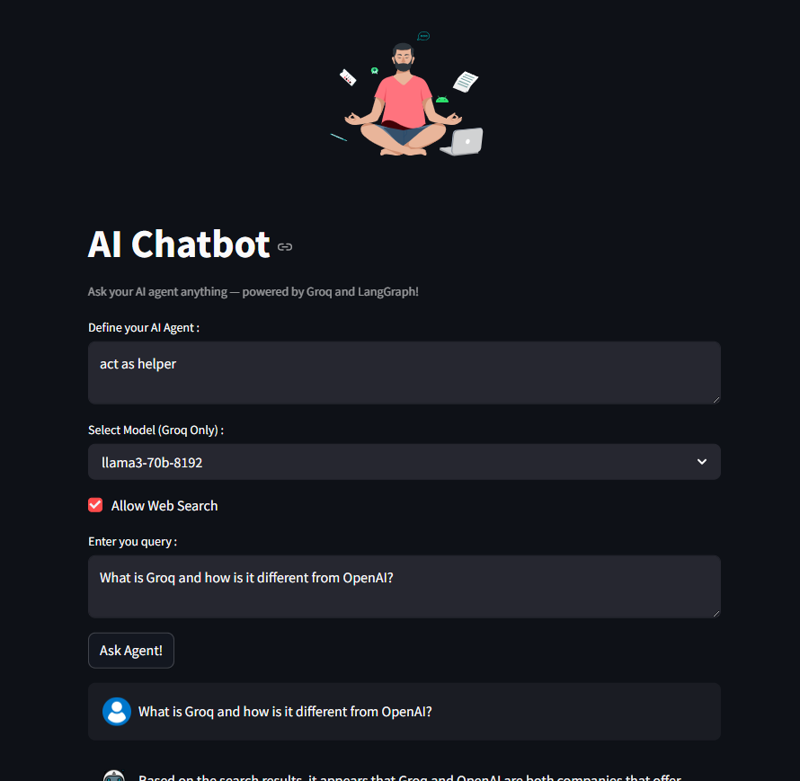

# 🤖 LangGraph AI Chatbot 

An intelligent AI chatbot built using **LangGraph Agents**, **FastAPI**, **Streamlit**, and **Groq LLMs**, enhanced with **Tavily Web Search** functionality.  
A clean frontend + powerful backend = seamless chatbot experience!

---

## 📸 Screenshot
### Chatbot Interface

---

## 🛠️ Tech Stack

- **Python 3.10**
- **LangGraph** (AI Agent Framework)
- **FastAPI** (Backend API)
- **Streamlit** (Frontend UI)
- **Groq LLMs** (llama3 models)
- **Tavily** (Web Search API)
- **Pydantic** (Request Validation)
- **dotenv** (Environment Variables)

---

## 🚀 How It Works

1. **Frontend** (Streamlit) collects user query, model selection, system prompt, etc.
2. **Backend** (FastAPI) handles request, initializes the AI Agent dynamically based on input.
3. **LangGraph Agent** communicates with **Groq models** and optionally uses **Tavily Search** for real-time information.
4. **Result** is returned back to the frontend and displayed beautifully along with avatars and download options.

---

## 📂 Project Structure

- ├── AI_Agent.py # LangGraph agent setup
- ├── Backend.py # FastAPI backend server
- ├── Frontend.py # Streamlit frontend UI
- ├── app.py # Entry point to run the app
- ├── requirements.txt # List of required Python packages
- ├── .env # Environment variables (API keys) 
- ├── venv/ # Virtual environment (not pushed)
- ├── README.md # Project Documentation

---

## Create and activate a virtual environment
- python -m venv venv
- source venv/bin/activate      # MacOS/Linux
- venv\Scripts\activate         # Windows

---

## Add your .env file 
- GROQ_API_KEY = your_groq_api_key_here
- TAVILY_API_KEY = your_tavily_api_key_here

---

## 🧠 Supported LLM Models
- llama3-70b-8192
- llama-3.3-70b-versatile

---

## 📢 Features
- Dynamic model selection (Groq)
- Custom system prompts
- Real-time web search (Tavily integration)
- Beautiful chat history with avatars
- Download AI responses easily
- Lightweight and beginner-friendly

---

## 🙏 Acknowledgements
- A heartfelt thank you to AIbyHassan on YouTube — this project wouldn’t have come to life without his insightful tutorials and guidance.
- His content makes complex LangChain & multi-agent systems feel simple and achievable. If you're diving into AI agents, his videos are a must-watch!
🎥 AI with Hassan - [YouTube Channel](https://www.youtube.com/@AI.with.Hassan)

--

## 👨‍💻 Author
- Made with ❤️ by Uzma Khatun
- Connect on [LinkedIn](https://www.linkedin.com/in/uzma-khatun-88b990334/)
